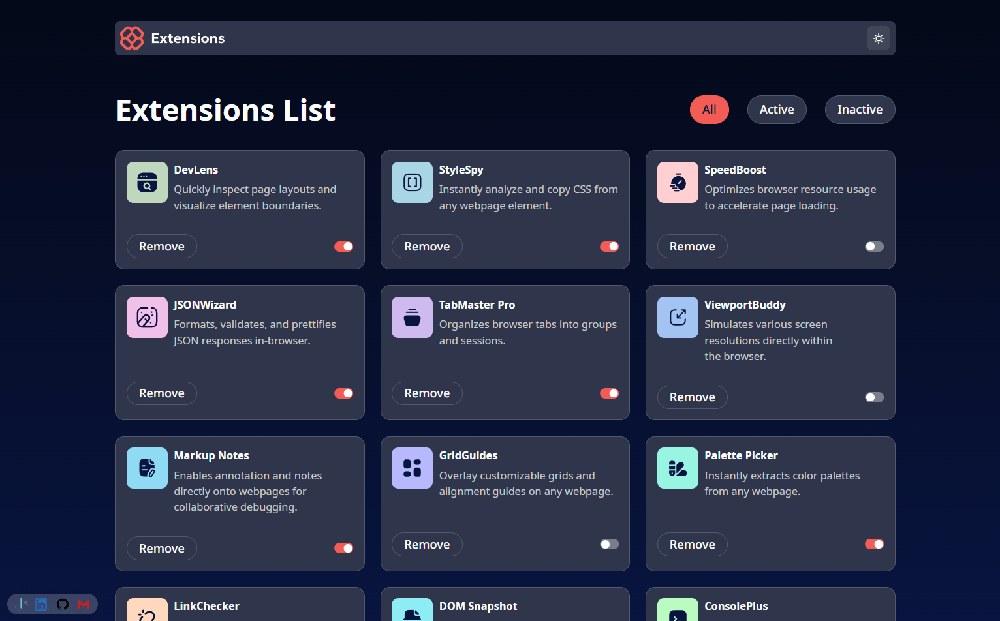
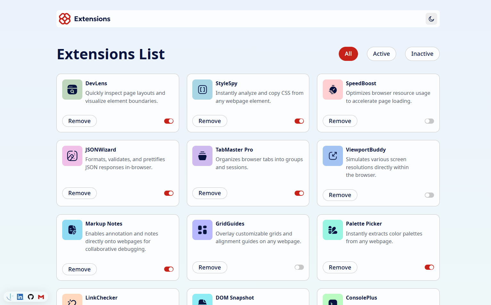
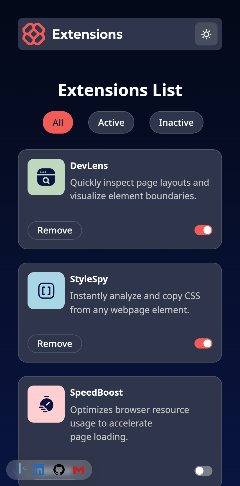
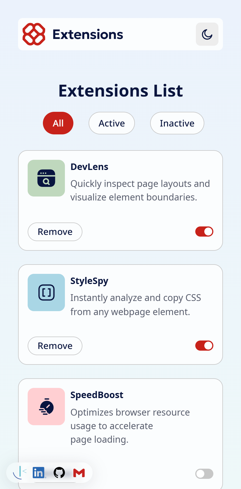

# Browser Extensions Manager UI

This is a solution to the [Browser extensions manager UI challenge on Frontend Mentor](https://www.frontendmentor.io/challenges/browser-extension-manager-ui-yNZnOfsMAp). Frontend Mentor challenges help you improve your coding skills by building realistic projects.

## Table of contents

- [Overview](#overview)
  - [The challenge](#the-challenge)
  - [Screenshot](#screenshot)
  - [Links](#links)
- [My process](#my-process)
  - [Built with](#built-with)
  - [Features](#features)
  - [Project structure](#project-structure)
  - [What I learned](#what-i-learned)
  - [Continued development](#continued-development)
  - [Useful resources](#useful-resources)
- [Author](#author)
- [Getting started](#getting-started)

## Overview

### The challenge

Users should be able to:

- Toggle extensions between active and inactive states
- Filter active and inactive extensions
- Remove extensions from the list with confirmation dialog
- Switch between light and dark color themes
- View the optimal layout for the interface depending on their device's screen size
- See hover and focus states for all interactive elements on the page

### Screenshot

#### Browser Extensions Manager UI: desktop dark mode



#### Browser Extensions Manager UI: desktop light mode



#### Browser Extensions Manager UI: mobile dark mode



#### Browser Extensions Manager UI: mobile light mode



### Links

- Solution URL: [GitHub repository](https://your-solution-url.com)
- Live Site URL: [Vercel](https://your-live-site-url.com)

## My process

### Built with

- **React 19** - Latest React version with modern features
- **TypeScript** - For type safety and better development experience
- **Vite** - Fast build tool and development server
- **CSS Modules** - For component-scoped styling
- **CSS Custom Properties** - For theming and design system
- **CSS Container Queries** - For responsive design
- **Semantic HTML5** - Accessible and meaningful markup
- **CSS Grid & Flexbox** - Modern layout techniques
- **Mobile-first workflow** - Progressive enhancement approach

### Features

#### 🎨 **Advanced Theming System**
- Light/Dark mode toggle with system preference detection
- Smooth theme transitions with CSS custom properties
- Color scheme persistence across sessions

#### 🔧 **Extension Management**
- **Filter Extensions**: All, Active, or Inactive states
- **Toggle Status**: Enable/disable extensions with visual feedback
- **Remove Extensions**: Confirmation dialog prevents accidental deletion
- **Real-time Updates**: State management with React hooks

#### 📱 **Responsive Design**
- Mobile-first approach (320px - desktop)
- Flexible grid layout that adapts to content
- Touch-friendly interface elements
- Accessible navigation

#### ♿ **Accessibility Features**
- Keyboard navigation support
- Focus management
- High contrast support
- Semantic HTML structure

### Project Structure

```
src/
├── components/           # Reusable UI components
│   ├── Button/          # Generic button component
│   ├── Card/            # Extension card with actions
│   ├── CheckButton/     # Toggle switch component
│   ├── Contact/         # Footer contact links
│   ├── ExtensionFilter/ # Filter radio buttons
│   ├── ExtensionList/   # Grid of extension cards
│   ├── HeaderBar/       # App header with logo and theme toggle
│   ├── Icon/            # App logo component
│   └── ToggleButton/    # Theme switcher
├── containers/          # Page-level components
│   └── Extensions/      # Main extensions container
├── hooks/               # Custom React hooks
│   └── useExtensions.ts # Extension state management
├── types/               # TypeScript type definitions
│   └── index.ts         # Shared interfaces and types
├── data/                # Static data
│   └── data.json        # Extensions dataset
└── assets/              # Static assets
    ├── css/             # Global styles and reset
    ├── fonts/           # Noto Sans font family
    └── images/          # Icons and logos
```

### Dev techniques applied

#### **Advanced React Patterns**
```tsx
// Custom hook for state management and business logic
export const useExtensions = () => {
  const [data, setData] = useState<Extension[]>(jsonData)
  const [currentFilter, setCurrentFilter] = useState<FilterType>('All')

  const filteredData = useMemo(() => {
    switch (currentFilter) {
      case 'Active': return data.filter(ext => ext.isActive)
      case 'Inactive': return data.filter(ext => !ext.isActive)
      default: return data
    }
  }, [data, currentFilter])

  // ... rest of hook logic
}
```

#### **Modern CSS Techniques**
```css
/* CSS Custom Properties for theming */
:root {
  color-scheme: light dark;
  --background-color: light-dark(#ebf2fc, #040918);
  --text-color: light-dark(var(--neutral-600), var(--neutral-300));
}

/* Responsive grid with CSS Grid */
.extensionGrid {
  display: grid;
  grid-template-columns: repeat(auto-fill, minmax(300px, 1fr));
  gap: 1.5rem;
}
```

#### **TypeScript Best Practices**
```typescript
// Strongly typed interfaces for better development
export interface Extension {
  logo: string;
  name: string;
  description: string;
  isActive: boolean;
}

export type FilterType = 'All' | 'Active' | 'Inactive'
```

#### **Dialog API Implementation**
```tsx
// Native HTML dialog for confirmation modals
const openDialog = () => {
  const dialog = document.getElementById(dialogId) as HTMLDialogElement;
  if (dialog) {
    dialog.showModal();
  }
};
```

### Continued development

Areas for future enhancement:

- **Data Persistence**: Local storage or API integration
- **Search Functionality**: Filter extensions by name/description  
- **Analytics**: Usage statistics and performance metrics
- **Animation**: Framer Motion for enhanced UX
- **Testing**: Unit and integration tests with Vitest
- **Extension Categories**: Grouping and sorting capabilities

### Useful resources

- [CSS Custom Properties Guide](https://developer.mozilla.org/en-US/docs/Web/CSS/Using_CSS_custom_properties) - Essential for the theming system
- [React Hook Patterns](https://reactjs.org/docs/hooks-custom.html) - For creating the useExtensions hook
- [CSS Grid Complete Guide](https://css-tricks.com/snippets/css/complete-guide-grid/) - For responsive layouts
- [Dialog Element](https://developer.mozilla.org/en-US/docs/Web/HTML/Element/dialog) - Native modal implementation
- [Accessibility Guidelines](https://www.w3.org/WAI/WCAG21/quickref/) - WCAG compliance reference

## Author

- **Frontend Mentor**: [HaDo Dev](https://www.frontendmentor.io/profile/hadodev)
- **LinkedIn**: [Hamza C. Doukkali](https://www.linkedin.com/in/hamza-c-doukkali-26434a335/)
- **GitHub**: [HaDo Dev](https://github.com/hadodev)
- **Email**: [Gmail](mailto:hado.dev.app@gmail.com)

## Getting started

### Prerequisites

- Node.js (v18 or higher)
- npm, yarn, or pnpm

### Installation

1. **Clone the repository**
   ```bash
   git clone https://github.com/hadodev/browser-extensions-manager.git
   cd browser-extensions-manager
   ```

2. **Install dependencies**
   ```bash
   npm install
   # or
   yarn install
   # or
   pnpm install
   ```

3. **Start development server**
   ```bash
   npm run dev
   # or
   yarn dev
   # or
   pnpm dev
   ```

4. **Build for production**
   ```bash
   npm run build
   # or
   yarn build
   # or
   pnpm build
   ```

5. **Preview production build**
   ```bash
   npm run preview
   # or
   yarn preview
   # or
   pnpm preview
   ```

### Development

- **Development server**: Runs on `http://localhost:5173`

---

**Challenge by [Frontend Mentor](https://www.frontendmentor.io?ref=challenge) | Coded by [HaDo Dev](https://github.com/hadodev)** 🚀
